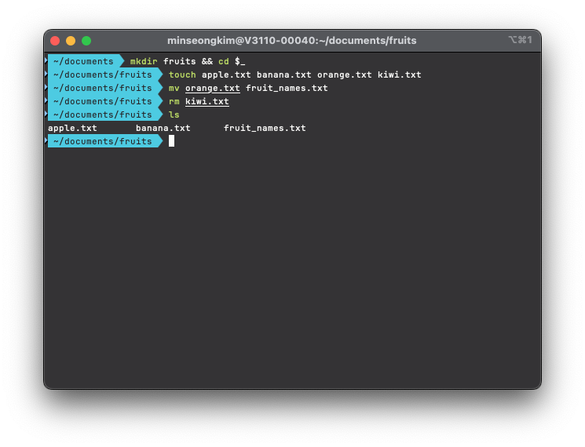
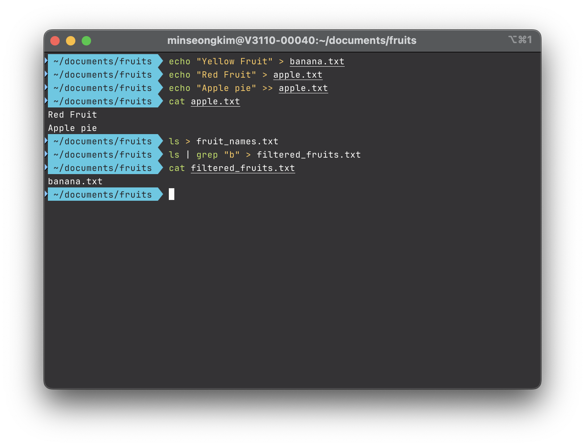
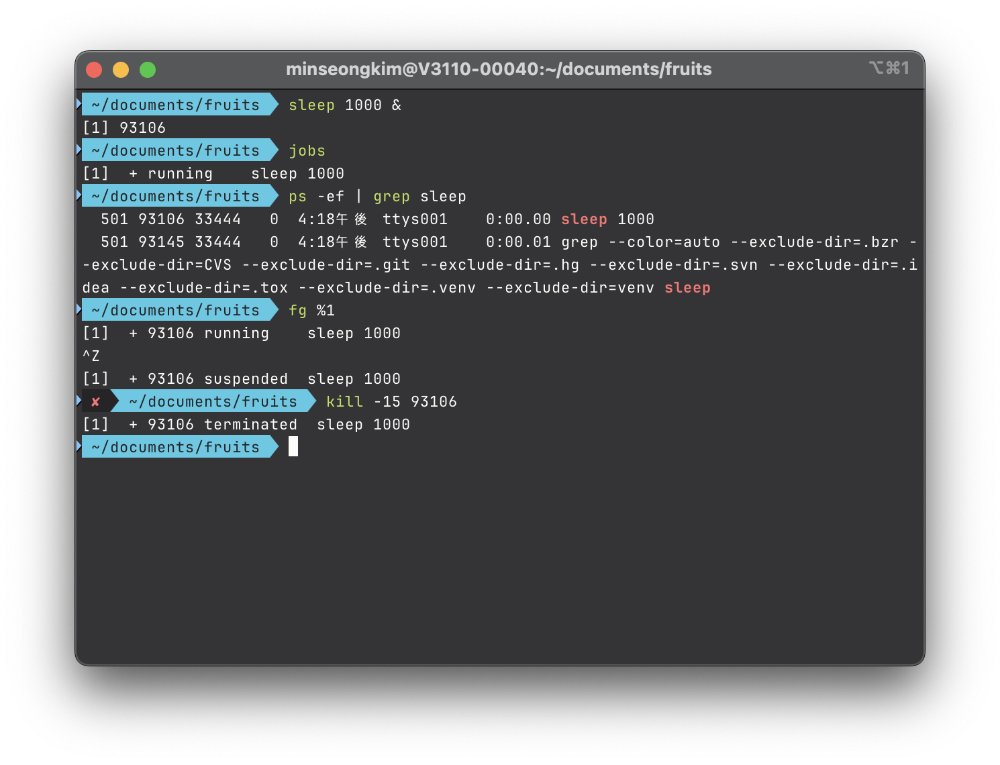
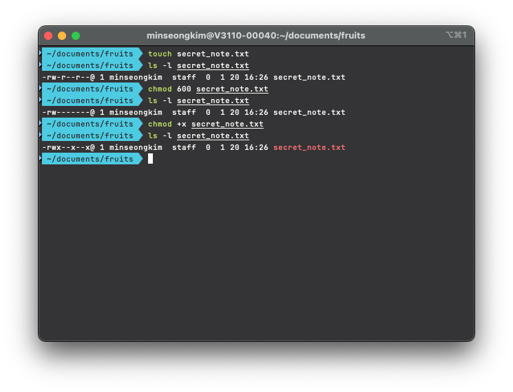

# Unix Basics

* **Module:** [LPC-000](000-unix-basics.md)
* **Date:** 2026-01-20
* **Environment:** macOS Sequoia / iTerm2

## 📝 Introduction 
This module covers core Unix operations, including shell navigation, data stream processing, and resource management.

## 🎯 Objectives
* Understand fundamental Unix shell navigation.
* Process data efficiently using Pipes (`|`) and Redirections (`>`, `<`).
* Perform standard file manipulation commands.
* Monitor and manage system processes.
* Learn user/group permission systems and access control.

## 💡 Motivation
To master data processing via pipelines, diagnose process states, and maintain security through permission settings in server environments where a GUI is unavailable.

## 📖 Concepts

### Filesystem Navigation & Operation
The Unix filesystem uses a hierarchical tree structure where "everything is a file." Engineers access resources via logical paths, independent of physical locations.

| Command     | Primary Function                         | Key Options       |
| :---------- | :--------------------------------------- | :---------------- |
| **`pwd`**   | Print absolute path of current directory | `N/A`             |
| **`ls`**    | List directory contents and metadata     | `-al`, `-h`, `-t` |
| **`cd`**    | Change process working directory         | `~`, `-`, `..`    |
| **`cp`**    | Copy files and directories               | `-r`, `-p`, `-i`  |
| **`mv`**    | Move or rename objects                   | `-n`, `-f`        |
| **`rm`**    | Permanently remove filesystem entities   | `-rf`, `-i`       |
| **`touch`** | Create empty files or update timestamps  | `-a`, `-m`        |

#### Note
* **`ls -al`**: Shows all entities, including hidden files with permission and ownership metadata.
* **`cp -p`**: Preserves original metadata (timestamps, permissions). Essential for maintaining system consistency.
* **`cd -`**: Immediately returns to the previous directory. Minimizes context-switching overhead.

> [!CAUTION]
> **`rm -rf` (Recursive & Force)**
> Deletes directories recursively without confirmation. Use with extreme caution.


### Data Pipelines & Redirection
Construct powerful data processing lines by redirecting standard streams.

| Command  | Primary Function                       | Context / Rationale                       |
| :------- | :------------------------------------- | :---------------------------------------- |
| **`\|`** | Connect output/input between processes | Forms in-memory data workflows            |
| **`>`**  | Redirect stdout to a file (Overwrite)  | Permanent storage of execution results    |
| **`>>`** | Append stdout to the end of a file     | Log accumulation and history preservation |
| **`<`**  | Feed file content to stdin             | Input automation and test scenarios       |

#### Note
* **Pipe (`|`) Optimization**: Transfers data directly in memory without intermediate files. Reduces disk I/O costs.
* **Redirection (`>`) vs (`>>`)**: `>` overwrites existing data. Use `>>` for critical logs to prevent data loss.


### Process & Security
Defines mechanisms to ensure process visibility and comply with the multi-user security model.

| Command                | Primary Function                         | Key Options / Signals     |
| :--------------------- | :--------------------------------------- | :------------------------ |
| **`ps`**               | Display static list of running processes | `-ef`, `aux`              |
| **`top`** / **`htop`** | Real-time system resource monitoring     | `u [user]`, `p [PID]`     |
| **`kill`**             | Send signals to control processes        | `-15` (TERM), `-9` (KILL) |
| **`nice`**             | Set CPU scheduling priority              | `-n [value]` (-20 to 19)  |
| **`jobs`**             | Check background jobs in current session | `-l` (includes PID)       |
| **`chmod`**            | Modify file/directory access permissions | `+x`, `755`, `600`        |
| **`chown`**            | Change owner and group of an object      | `user:group`              |

#### Note
* **`htop`**: A key tool for diagnosing bottlenecks. Visualizes CPU load per core and memory usage.
* **`kill -15` vs `-9`**: `-15` (SIGTERM) allows safe exit. `-9` (SIGKILL) forces immediate termination.
* **`chmod 755` vs `644`**: Follows the "Principle of Least Privilege." 755 for scripts, 644 for data.

> [!IMPORTANT]
> **Unix Permission Bitmask**
> Permissions are calculated as an octal sum: `Read(4)` + `Write(2)` + `Execute(1)`. 
> Example: `7(4+2+1)` is full access; `5(4+0+1)` is Read and Execute only.


## 💻 Hands-on Implementation

### Case 1. Navigation & Operation

#### Scenario:
> 1. Create a `fruits` directory and generate `apple.txt`, `banana.txt`, `orange.txt`, and `kiwi.txt`.
> 2. Rename `orange.txt` to `fruit_names.txt`.
> 3. Delete `kiwi.txt`.

#### Execution:
```bash
# mkdir fruits && cd fruits
# $_ is a special parameter for the last argument of the previous command.
mkdir fruits && cd $_                             # Create directory and enter

touch apple.txt banana.txt orange.txt kiwi.txt    # Create txt files
mv orange.txt fruit_names.txt                     # Rename file
rm kiwi.txt                                       # Remove txt file

ls
```

#### Result:



### Case 2. Data Pipelines & Redirection

#### Scenario:
> 1. Write "Yellow Fruit" into `banana.txt`.
> 2. Write "Red Fruit" into `apple.txt`.
> 3. Append "Apple pie" to `apple.txt`.
> 4. Save the current file list to `fruit_names.txt`.
> 5. Filter files containing '`b`' and generate `filtered_fruits.txt`.

#### Execution:
```bash
echo "Yellow Fruit" > banana.txt                 # Create and write content
echo "Red Fruit" > apple.txt                     # Create and write content

echo "Apple pie" >> apple.txt                    # Append to existing content
cat apple.txt                                    # Verify appended content

ls > fruit_names.txt                             # Save directory file list

ls | grep "b" > filtered_fruits.txt              # Extract filenames containing 'b'
cat filtered_fruits.txt                          # Verify filtered results
```

#### Result:



### Case3. Process

#### Scenario:
> 1. Create a process using `sleep 1000`.
> 2. Check the job list in the current session.
> 3. Identify the PID of the running `sleep` process.
> 4. Bring the background job to the foreground.
> 5. Terminate the process safely.

#### Execution:

```bash
sleep 1000 &           # Create background process
jobs                   # Check jobs in current session

ps -ef | grep sleep    # Filter sleep processes and identify PID
fg %1                  # Bring job #1 to foreground

kill -15 [PID]         # Terminate process safely
```

#### Result:



### Case4. System Security & Access Control

#### Scenario:
> 1. Create `secret_note.txt` and check default permissions.
> 2. Block all access for `Group` and `Others` using Numeric Mode.
> 3. Verify the permission bitmask.

#### Execution:

```bash
touch secret_note.txt        # Create file
ls -l secret_note.txt        # Check initial permissions

# 6(4+2, Read+Write) / 0(No access) / 0(No access)
chmod 600 secret_note.txt    # Restrict access to Owner only

ls -l secret_note.txt        # Verify settings

chmod +x secret_note.txt     # Add execute permission
ls -l secret_note.txt        # Verify bitmask change
```

#### Result:

