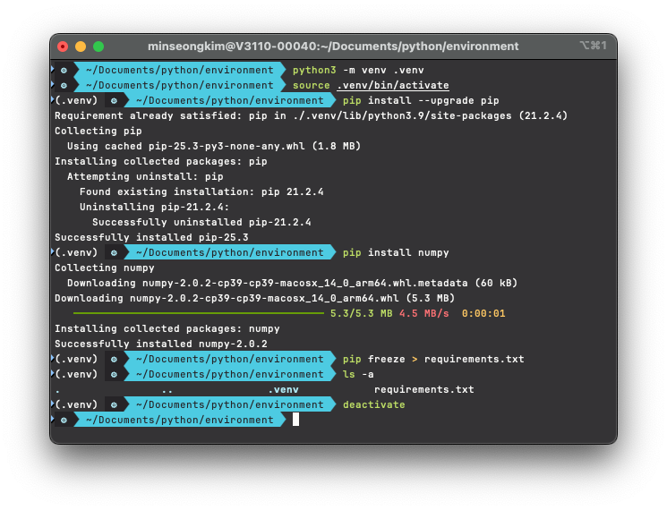
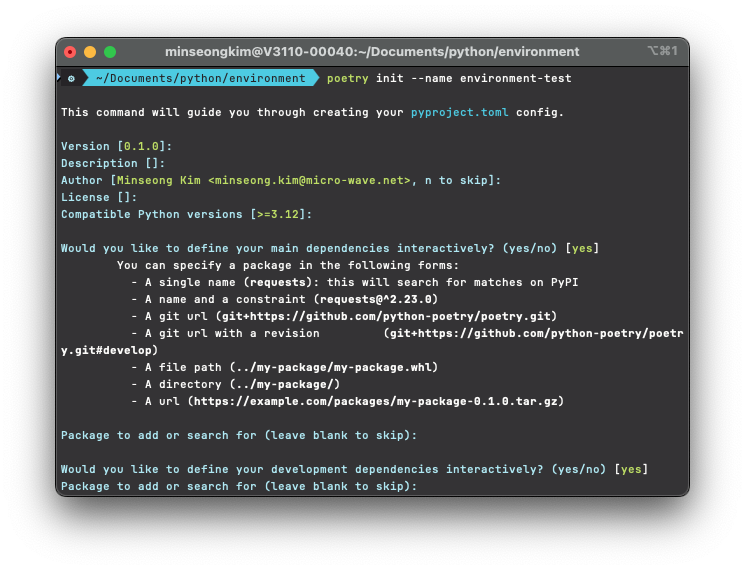
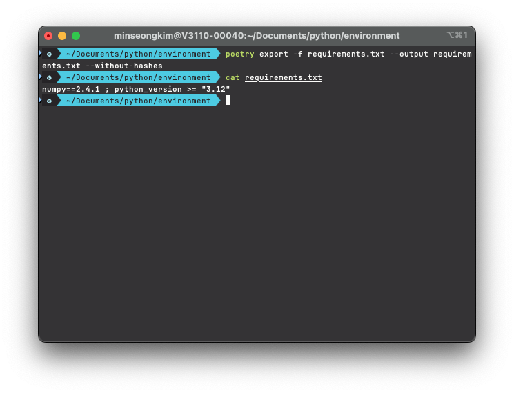

# Python environment

* Module: [LPC-001](001-python-environment.md)
* Date: 2026-01-21
* Environment: macOS Sequoia / Iterm2 / Python 3.12.0

## 📝 Introduction 

Understand why Python is the industry standard and learn how to build reproducible development environments.

## 🎯 Objectives

* Understand Python’s ecosystem and versatility.
* Build a Modern Python Stack.
* Master dependency management: pip vs. Poetry.
* Enforce project isolation using virtual environments.

## 💡 Motivation

Software depends on numerous external libraries. To solve the "It works on my machine" problem, we must ensure Reproducibility—guaranteeing that every team member runs the exact same environment.

## 📖 Concepts

### Language Foundations

Python is the "Standard Interface" of the modern data ecosystem.

* High Readability: Human-centric syntax allows focus on business logic.
* Rich Ecosystem: Massive library support and active community.
* Glue Language: Seamlessly connects C++/CUDA performance with user logic.

### Environment Management

Isolation is the gold standard in modern development.

| Tool   | Role               | Context                                                |
| :----- | :----------------- | :----------------------------------------------------- |
| pip    | Package Installer  | Standard built-in package manager.                     |
| Poetry | Dependency Manager | Modern tool for resolving dependencies & environments. |
| .venv  | Isolated Space     | Local folder storing project-specific libraries.       |

### Why Virtual Environments? (Mechanism)

* Isolation: Prevents polluting the global system environment.
* Version Coexistence: Run different versions (v1 vs. v2) across different projects.
* Reliability: Eliminates runtime errors caused by environment mismatches.

### Pip vs. Poetry

Poetry automatically resolves dependency conflicts—a common limitation of requirements.txt—and ensures a 100% consistent environment via poetry.lock.

| Feature       | venv + pip                   | Poetry                          |
| :------------ | :--------------------------- | :------------------------------ |
| Files         | `requirements.txt`           | `pyproject.toml`, `poetry.lock` |
| Key Advantage | Simple & Built-in            | Auto-dependency resolution      |
| Best For      | Light scripts, Docker builds | Complex projects, Team collab   |

### Environment Lifecycle

1. Create: Generate an isolated space.
2. Activate: Enter the environment to start working.
3. Deactivate: Exit back to the system environment.

## 💻 Hands-on Implementation

### Case 1. venv + pip + requirements.txt

#### Scenario:
> 1. Create and activate a virtual environment using the `venv` module.
> 2. Install `numpy` using `pip`.
> 3. Export the installed package list to a `requirements.txt` file.

#### Execution:

```bash
python3 -m venv .venv           # Create virtual environment
source .venv/bin/activate       # Activate the environment

pip install --upgrade pip       # Upgrade pip 
pip install numpy               # install package

pip freeze > requirements.txt   # Record dependencies to requirements.txt
deactivate                      # Exit the environment
```

#### Result:


### Case 2.  Poetry

#### Scenario:
> 1. Initialize a new project using `poetry init`.
> 2. Add a library using `poetry add` to automate environment and lockfile management.

#### Execution:

```bash
poetry init --name my-app    # Initialize project configuration

# Add package (automatically manages .venv and updates poetry.lock)
poetry add numpy             
```

#### Result:


#### Note
> [!TIP]
> Why Export? While Poetry is superior for development, many cloud environments still default to `pip`. Using `poetry export` allows you to leverage Poetry's robust management while maintaining universal compatibility with pip-based systems.

#### Execution:

```bash
poetry self add poetry-plugin-export    # Install the Export plugin

# Generate requirements.txt (excluding hashes for maximum compatibility)
poetry export -f requirements.txt --output requirements.txt --without-hashes
```

#### Result:


## 🔗 Reference & Resources

- [**pyenv Official Guide**](https://github.com/pyenv/pyenv)
- [**pip User Guide**](https://packaging.python.org/en/latest/tutorials/installing-packages/)
- [**Poetry Official Docs**](https://python-poetry.org/docs/)
